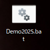
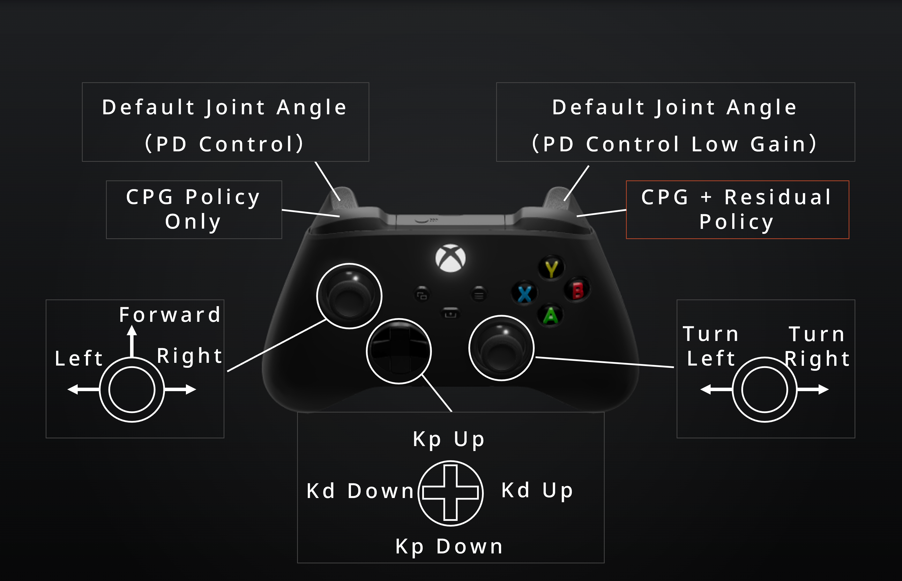

# Unitree A1 Demo 2025


[学習用コード](https://github.com/RSeto14/A1Genesis.git)

## Quick Start

### 準備するもの

- Unitree A1
- Unitree A1 バッテリー 及び バッテリーの充電器
- 黒のガムテープ
- Unitree A1 コントローラ
- Xbox コントローラ
- PC
- 適当な障害物

### Step1：Xboxのコントローラをペアリング
XboxのコントローラをPCにbluetoothまたは有線で接続（側面のペアリングボタンを長押し）

### Step2：バッテリーをはめる

Unitree A1 にバッテリーをはめる. この時、ガムテープでしっかり固定

### Step3：電源を入れる

Unitree A1 及び Unitree A1 コントローラの電源を入れる

どちらも電源ボタンを2回連続で押す(2回目は起動するまで長押し)

### Step4：A1をPassiveモードにする

Unitree A1 コントローラで「L2 + A」を３回押してロボットの姿勢を低くする

「L2 + B」で伏せる

### Step5：Unitree A1のWifiに接続


```
WI-FI: UnitreeRoboticsA1-620
Password: 00000000
```

### Step6：Scripts/server.pyを実行


下のアイコンをダブルクリック



または

```
conda activate demo2025
cd C:\Users\hayashibe-lab\A1_Demo_2025\Scripts
python server.py
```

Kp = 60, Kd = 2.0 に設定



### コマンド
- Forward
- Forward + Turn Left
- Forward + Turn Right
- Turn Left
- Turn Right
- Left
- Right

### おまけ
Scriptsのフォルダにあるファイルの説明
- policy.py policyクラスを定義しています。 (実行するとシミュレーションテストができます。)
- server.py PC側のサーバーを定義しています。
- xbox360_controller.py Xbox360コントローラの入力を取得するクラスを定義しています。
- PD.py Unitree A1にSSH接続してPD制御を実行するためのスクリプトです。

## 環境構築

### Set up the virtual environment
```
conda create -n demo2025 python=3.9
```

### Activate the virtual environment

```
conda activate demo2025
```

### Install the required packages

#### PyTorch

Install PyTorch from the official website.

<url>https://pytorch.org/</url>
```bash
pip install torch torchvision torchaudio --index-url https://download.pytorch.org/whl/cu121
```

#### 2.2. Other Packages

```
pip install pygame
pip install numpy

pip install genesis-world
git clone https://github.com/leggedrobotics/rsl_rl
cd rsl_rl && git checkout v1.0.2 && pip install -e .
pip install tensorboard
pip install pytz
pip install PyYAML
pip install open3d
paramiko
```


## 初めてのPCで実行する場合

### Wifi接続

```
WI-FI: UnitreeRoboticsA1-620
Password: 00000000
```

### Ip Address
```
C:\Users\hayashibe-lab>ipconfig

Windows IP 構成


イーサネット アダプター Ethernet:

   メディアの状態. . . . . . . . . . . .: メディアは接続されていません
   接続固有の DNS サフィックス . . . . .:

Wireless LAN adapter Local Area Connection* 1:

   メディアの状態. . . . . . . . . . . .: メディアは接続されていません
   接続固有の DNS サフィックス . . . . .:

Wireless LAN adapter Local Area Connection* 2:

   メディアの状態. . . . . . . . . . . .: メディアは接続されていません
   接続固有の DNS サフィックス . . . . .:

Wireless LAN adapter Wi-Fi 2:

   接続固有の DNS サフィックス . . . . .:
   リンクローカル IPv6 アドレス. . . . .: fe80::15aa:9663:5c37:936%19
   IPv4 アドレス . . . . . . . . . . . .: 192.168.12.240
   サブネット マスク . . . . . . . . . .: 255.255.255.0
   デフォルト ゲートウェイ . . . . . . .: 192.168.12.1

イーサネット アダプター Bluetooth Network Connection:

   メディアの状態. . . . . . . . . . . .: メディアは接続されていません
   接続固有の DNS サフィックス . . . . .:
```

```
IPv4 アドレス . . . . . . . . . . . .: 192.168.12.240
```

### IPアドレスの書き換え

unitree_legged_sdk\code\joint_pd.cpp

105行目あたり

```
    if (inet_pton(AF_INET, "192.168.12.240", &serv_addr.sin_addr) <= 0) {
        std::cerr << "Invalid address/ Address not supported" << std::endl;
        return;
    } // 無線
```

Scripts/server.py

31行目あたり
```
self.host = "192.168.12.240"
```

### SCP

A1にフォルダをコピー

```
scp -r unitree_legged_sdk pi@192.168.12.1:/home/pi/Demo2025
```

コンパイル

sshのパスワードは 123
```
ssh pi@192.168.12.1
cd /home/pi/Demo2025/unitree_legged_sdk
mkdir build
cd build
cmake ..
make
```


### Gain

学習時（シミュレーション）
```
Kp = 65
Kd = 1
```

実機
```
Kp = 60
Kd = 2.0
```
